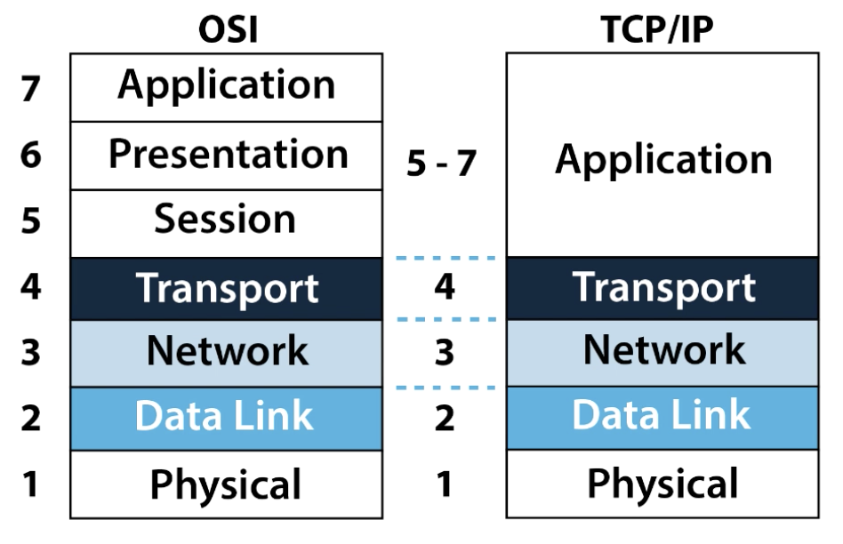

# Introduction to TCP/IP Networking

Networks work correctly because the various devices and software follow the rules. Those rules come in the form of standards and protocols, which are agreements of a particular part of how a network should work.

**Networking models define a structure and different categories (layers) of standards and protocols.**

# Table of Contents
1. [The TCP/IP Networking Model](#TCPIPModel)

# 1. The TCP/IP Networking Model

## 1.1. Networking Model
*   A *network model*, sometimes also called either a *networking architecture* or *networking blueprint*, refers to a comprehensive set of documents. Individually, each document describes one small function required for a network; collectively, these documents define everything that should happen for a computer network to work.
*   Some documents define a *protocol*, which is a set of logical rules that devices must follow to communicate.
*   Other documents define some physical requirements for networking.

## 1.2. Overview of the TCP/IP Networking Model
*   The TCP/IP model both defines and references a large collection of protocols that allow computers to communicate. To define a protocol, TCP/IP uses documents called *Requests For Comments (RFC)*.
*   The TCP/IP refers to standards or protocols created by some other standards body or vendor consortium. This avoids repeating work aready done.
*   The Ethernet card, or wireless LAN card, built in to the computer implements some LAN standards referenecd by the TCP/IP model - which helps the computer communicate through a network. 

*   The networking model breaks the functions into a small number of
    categories called *layers*. Each layer includes protocols and standards that relate to that category of functions.  
    
    *   The physical layer focuses on how to transmit bits over each individual link. 
    *   The data-link layer focuses on sending data over one type of physical link: for instance, networks use different data-link protocols for Ethernet LANs versus Wireless LANs.
    *   The network layer focuses on delivering data over the entire path from the orifinal sending computer to the final destination computer.
    *   Transport and Application layers focus more on the applications that need to send and receive the data.

*   A few TCP/IP protocols:  

    | TCP/IP Architecture Layer | Example Protocols      |
    |---------------------------|------------------------|
    | Application               | HTTP, POP3, SMTP       |
    | Transport                 | TCP, UDP               |
    | Internet                  | IP, ICMP               |
    | Data Link & Physical      | Ethernet, 802.11(WiFi) |

## 1.3. TCP/IP Application Layer
*   TCP/IP application Layer protocols provide services to the application software running on a computer. The application layer does not define the application itself, but it defines services that applications need. For example, application protocol HTTP defines how web browsers can pull the contents of a web page from a web server.
*   The application layer provides an interface between software running on a computer and the network itself.

### 1.3.1. HTTP Overview
